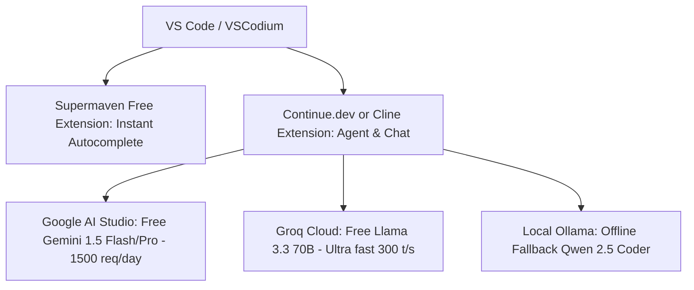

# 02. AI IDEs & Developer Coding Assistants

> **Last Updated**: October 3, 2026  
> **Coverage**: AI-native IDEs, VS Code / JetBrains extensions, terminal pair-programmers, and autonomous coding agents.

---

## Master Comparison Matrix: Coding Assistants

| Tool | Type | Free Tier Allowances | Token / Context Quota | Paid Upgrade | Is Paid Worth It? | Best Free Alternative |
|---|---|---|---|---|---|---|
| **Cursor** | AI Native IDE (VS Code fork) | 2,000 completions/mo + 50 slow premium requests one-off + 2-week Pro trial | 8k-128k (model dependent) | Pro: $20/mo Business: $40/seat/mo | **7/10** (Smooth UX, but expensive when free setups exist) | **Windsurf Free**, **Cline + Gemini Flash**, **Void** |
| **Windsurf (Codeium)** | AI Native IDE (Cascade Flows) | Unlimited inline code completion forever + ~100 Cascade/Chat credits | 32k - 128k tokens | Pro: $15/mo Teams: $30/seat/mo | **8/10** (Competitive pricing, better free tier than Cursor) | **Continue.dev**, **Supermaven Free** |
| **GitHub Copilot** | VS Code / JetBrains Extension | 2,000 completions/mo & 50 chat prompts/mo (Free tier); 100% Free for verified students/teachers/OSS maintainers | 8k - 32k tokens | Individual: $10/mo or $100/yr | **6/10** (Convenient in enterprise, lagging behind agentic tools) | **Amazon Q Developer (Free)**, **Codeium** |
| **Supermaven** | Autocomplete Extension | Unlimited inline completions using custom ultra-fast Babble model | 300,000 tokens (longest context for completions) | Pro: $10/mo (Full GPT-4o chat) | **5/10** (Free autocomplete is already blazing fast) | **Codeium Autocomplete (Free)** |
| **Continue.dev** | Open Source Extension (VS Code / JetBrains) | **100% Free forever** (BYOK: Bring Your Own Key or Local Ollama) | Unlimited (determined by your free API key or local GPU) | None ($0 open-source) | **N/A** (Completely free) | **Self-hosted / Native** |
| **Cline (ex-Claude Dev) & Roo Code** | Autonomous Coding Agent (VS Code) | **100% Free forever** (Open source agent). Connect free Gemini Flash or Groq API key | Full repository context (up to 1M with Gemini Flash) | None ($0 open-source) | **N/A** (Completely free) | **Aider**, **Continue.dev** |
| **Aider** | CLI Terminal AI Pair Programmer | **100% Free forever** (Git-native CLI tool). Connect to free API keys or Ollama | Context matches chosen API | None ($0 open-source) | **N/A** (Completely free) | **Cline**, **Continue.dev** |
| **Void** | Open-source Cursor Alternative | **100% Free forever** (Clean VS Code fork with local / BYOK integration) | Unlimited with local / free API keys | None ($0 open-source) | **N/A** (Completely free) | **Cursor Free**, **Windsurf** |
| **Amazon Q Developer** | IDE Extension | **Unlimited inline code suggestions** + 50 chat messages/mo + 5 workspace transformations/mo | 32k tokens | Pro: $19/user/mo | **4/10** (Free tier is generous; Pro is geared toward AWS enterprise) | **Codeium Free**, **GitHub Copilot Free** |
| **Sourcegraph Cody** | IDE Extension | 200 completions/mo + 20 chat & command prompts/mo (Claude 3.5 Sonnet / GPT-4o) | 32k tokens | Pro: $9/mo | **5/10** (Cheap, but limits are restrictive) | **Cline + Gemini Flash**, **Continue.dev** |
| **Tabnine** | IDE Extension | Basic short inline completions (runs on local CPU/cloud hybrid) | Minimal context (<2k tokens) | Pro: $12/mo | **3/10** (Outdated completions compared to modern LLMs) | **Supermaven Free**, **Codeium Free** |

---

## Detailed Tool Breakdowns

### 1. Cursor (Anysphere)
* **Website**: [cursor.com](https://www.cursor.com)
* **What It Does**: The leading AI-first code editor, built as a fork of VS Code. Features `Cmd+K` in-line editing, `@` codebase indexing, composer multi-file editing, and agentic terminal execution.
* **Free Tier Quotas**:
  * **Hobby Plan**: 2,000 free AI completions per month.
  * **Slow Requests**: 50 one-time slow requests to premium models (Claude 3.5 Sonnet / GPT-4o).
  * **Pro Trial**: 14 days of free Pro access upon initial registration.
  * **Reset Interval**: Monthly on the account creation date.
* **Paid Tier**: $20/month for Pro (500 fast premium requests per month, unlimited slow requests, priority indexing).
* **Is Paying Worth It?**: **7 / 10**
  * *Pros*: Zero setup friction, top-tier multi-file composer (`Cmd+I`), excellent codebase semantic search.
  * *Cons*: 500 fast requests run out in 10-15 days for full-time developers. Slow queue gets delayed during peak US hours.
  * *Verdict*: Excellent if you bill clients and want turnkey convenience. But for developers who want zero recurring costs, an open-source setup provides identical power for $0.
* **Best Free Alternative**: **Windsurf Free Tier** or **Cline (VS Code) paired with Google Gemini 1.5 Flash API (100% free)**.

---

### 2. Windsurf (by Codeium)
* **Website**: [codeium.com/windsurf](https://codeium.com/windsurf)
* **What It Does**: Direct competitor to Cursor. Features "Flows" and "Cascade" — an agent that analyzes your terminal, files, and git tree to execute multi-step modifications automatically.
* **Free Tier Quotas**:
  * **Autocomplete**: 100% unlimited inline code completion forever (zero monthly limit).
  * **Cascade Credits**: ~100 free Cascade assistant prompts per month.
  * **Models**: Access to Claude 3.5 Sonnet and Codeium proprietary models.
  * **Reset Interval**: 30-day rolling cycle.
* **Paid Tier**: $15/month for Pro (Unlimited fast Cascade interactions, prioritized context retrieval).
* **Is Paying Worth It?**: **8 / 10**
  * *Verdict*: At $15/mo, it undercuts Cursor by $5 while offering unlimited free autocomplete and a very capable agentic Cascade workflow.
* **Best Free Alternative**: **Continue.dev** or **Cline**.

---

### 3. Continue.dev (The Ultimate Open-Source Companion)
* **Website**: [continue.dev](https://continue.dev) — [GitHub](https://github.com/continuedev/continue)
* **What It Does**: Open-source extension for VS Code and JetBrains IDEs. Brings Cursor-style chat, autocomplete, and code refactoring directly into your existing editor.
* **Cost & Limits**:
  * **100% Free Forever**.
  * **Token Limits**: Zero artificial limits imposed by the extension.
* **How to Run 100% Free**:
  1. Install the `Continue` extension from the VS Code Marketplace.
  2. For **Autocomplete**: Configure Supermaven or Ollama running `qwen2.5-coder:1.5b` or `deepseek-coder:1.3b` locally on your GPU/CPU (0ms latency, zero API cost).
  3. For **Chat & Edits**: Grab a **free Google AI Studio API key** and plug `gemini-1.5-flash` or `gemini-1.5-pro` into your `config.json`. You get 1,500 free requests per day and a 1M token context window.
  4. For **Fast Open Weights**: Connect a **free Groq Cloud API key** to run `llama-3.3-70b-versatile` at 300 tokens/second for free.

---

### 4. Cline & Roo Code (Autonomous Agent in VS Code)
* **Website**: [cline.bot](https://cline.bot) / [GitHub](https://github.com/cline/cline)
* **What It Does**: Autonomous coding agent that lives inside VS Code. Can create files, inspect directories, run shell commands in your terminal, self-correct errors, and execute entire feature roadmaps autonomously.
* **Cost & Limits**:
  * Open-source ($0).
* **The "Zero Dollar" Stack**:
  * Configure Cline to use **Google Gemini API** (`gemini-1.5-flash` or `gemini-2.0-flash-exp`).
  * Google AI Studio grants **15 requests per minute, 1,000,000 tokens per minute, and 1,500 requests per day 100% free**.
  * *Result*: A completely autonomous coding agent with a 1,000,000-token context window that can read your entire codebase without spending a single penny.

---

### 5. Supermaven
* **Website**: [supermaven.com](https://supermaven.com)
* **What It Does**: Specialized inline code completion engine created by Jacob Jackson (creator of Tabnine). Built on a custom model ("Babble") with an unprecedented 300,000-token context window.
* **Free Tier Quotas**:
  * **Completions**: Unlimited inline suggestions on the free tier.
  * **Latency**: Ultra-fast (<100ms response time).
* **Paid Tier**: $10/month for Pro (Adds full multi-turn chat with GPT-4o and advanced repository context).
* **Is Paying Worth It?**: **5 / 10**
  * *Verdict*: Do not pay for Pro. The free inline autocomplete tier is where 95% of its value lies. Pair Supermaven Free for autocomplete with Cline/Continue for chat.

---

### 6. Aider (Command-Line AI Pair Programmer)
* **Website**: [aider.chat](https://aider.chat)
* **What It Does**: Terminal-based AI pair programmer that integrates directly with local Git repositories. It automatically commits clean, formatted diffs to git with meaningful commit messages.
* **Cost & Limits**:
  * 100% Free open-source CLI (`pip install aider-chat`).
* **Free Engine Integration**:
  * Run with free Gemini key: `aider --model gemini/gemini-1.5-flash`
  * Run with free Groq key: `aider --model groq/llama-3.3-70b-versatile`
  * Run with local Ollama: `aider --model ollama/qwen2.5-coder:7b`

---

## Free IDE Stack Recommendation for 2026

To achieve full coding autonomy without paying $240/year in subscriptions:

* **Inline Autocomplete**: **Supermaven Free** (Unlimited, 300k context, instant response).
* **Deep Agentic Coding & Refactoring**: **Cline** or **Roo Code** powered by **Gemini 1.5 Flash** (Free via Google AI Studio).
* **Speed / CLI Quick Tweaks**: **Aider** powered by **Groq Llama 3.3 70B** (Free tier).
* **Total Monthly Cost**: **$0.00**.
