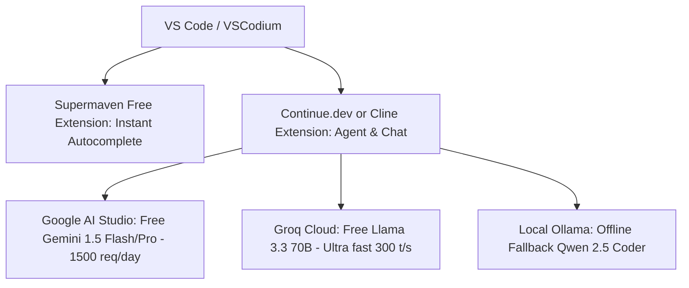

# 02. AI IDEs & Developer Coding Assistants

> **Last Updated**: October 3, 2026  
> **Coverage**: AI-native IDEs, VS Code / JetBrains extensions, terminal pair-programmers, web app generators, and autonomous coding agents.

---

## 🏆 What is the Best AI Tool for Coding?

Rather than a single blanket winner, modern AI coding tools excel in different roles across the development lifecycle. Here is the direct, verified breakdown:

* 🥇 **Best Overall for Real Software Engineering (Autonomous Multi-File Agent)**: [**Cline**](https://cline.bot) & [**Zoo Code**](https://zoocode.dev) (Community Continuation of Roo Code) inside VS Code  
  * **Why it wins**: Traditional AI chat extensions only output markdown snippets that you have to copy-paste manually. Cline and Zoo Code operate as autonomous software engineers inside VS Code. They inspect your file tree, edit multiple files in parallel, execute terminal commands (`npm run build`, `pytest`, `cargo check`), analyze terminal error stacks, and self-repair code until everything builds and passes tests. Paired with a free [Google AI Studio API Key](https://aistudio.google.com) (`gemini-1.5-flash`), you receive **1,500 daily agentic requests and a 1,000,000-token context window for $0.00**.
  * *(Project Status Note)*: The original Roo Code extension was officially archived and discontinued in May 2026 as its founding team pivoted to "Roomote" (a cloud-native agent platform). In response, the open-source community created **Zoo Code** (`zoocode.dev`) as the direct, actively maintained continuation, preserving 100% backward compatibility with `.roomodes` rules, alongside upstream **Cline**.
* 🥈 **Best Freemium AI-Native IDE**: [**Windsurf (by Codeium)**](https://codeium.com/windsurf)  
  * **Why it wins**: Windsurf matches Cursor's agentic workflow through "Cascade" (which analyzes your terminal, git history, and files), while offering a drastically more generous free tier: **100% unlimited inline code autocomplete forever** and ~100 Cascade credits/mo for $0. If you ever upgrade, its Pro plan is $15/mo ($5 cheaper than Cursor).
* 🥉 **Best Turnkey Standalone AI IDE**: [**Cursor**](https://www.cursor.com)  
  * **Why it wins**: The benchmark for polished AI editor UX. Seamless multi-file Composer (`Ctrl+I`), background terminal execution, and deep repository indexing. Its paid Pro tier is $20/mo (500 fast requests/mo), while the free Hobby tier provides 2,000 completions/mo + 50 slow requests.
* ⚡ **Best Instant Ghost-Text Autocomplete**: [**Supermaven**](https://supermaven.com)  
  * **Why it wins**: Sub-100 millisecond response time. Powered by their custom Babble model with a **300,000-token context window** that reads your open files in memory. Free tier provides **unlimited completions forever**; never pay $10/mo for its chat—use the free autocomplete and pair with Cline or Continue for chat.
* 🛡️ **Best Open-Source Modular Copilot (Zero Lock-In)**: [**Continue.dev**](https://continue.dev)  
  * **Why it wins**: Complete open-source freedom. Integrates Cursor-like `Ctrl+I` inline edits and `@` codebase search directly into standard VS Code and JetBrains IDEs. Connects to any free cloud API (Groq, Gemini, Mistral) or 100% offline local Ollama models (`qwen2.5-coder:14b`) with zero telemetry.
* 💻 **Best Terminal & Git Pair Programmer**: [**Aider**](https://aider.chat)  
  * **Why it wins**: CLI-native tool that automatically commits tested changes directly to git with clean, conventional commit messages. Consistently ranks at the very top of the SWE-bench coding benchmarks.
* 🌐 **Best Web App & Fullstack UI Builders**: [**v0 by Vercel**](https://v0.dev) & [**Bolt.new**](https://bolt.new)  
  * **Why choose them**: Turn simple text prompts into fully working, responsive Next.js/React full-stack web applications with instant live browser previews. v0 provides 200 free monthly credits; Bolt provides daily sandbox compute.

---

## Master Comparison Matrix: Coding Assistants

| Tool | Type | Free Tier Allowances | Token / Context Quota | Paid Plans & Pricing | Why Choose This Tool | Why Skip / Limitations | Best For |
|---|---|---|---|---|---|---|---|
| [**Cline**](https://cline.bot) / [**Zoo Code**](https://zoocode.dev) | VS Code Agent | **100% Free Open Source** (BYOK) | Full repo context (up to 1M with Gemini Flash) | None ($0 open-source) | Autonomous multi-file editing, executes terminal tests, auto-fixes compiler errors | High token usage; requires user-provided API key | Complex feature implementation & multi-file refactoring |
| [**Windsurf (Codeium)**](https://codeium.com/windsurf) | AI Native IDE | **Unlimited inline completions** + ~100 Cascade credits/mo | 32k - 128k tokens | Pro: $15/mo Teams: $30/seat/mo | Cascade multi-file agent, unlimited free autocomplete forever, cheaper than Cursor | Closed-source fork; free Cascade credits run out fast | Turnkey AI-first IDE with the best free tier |
| [**Supermaven**](https://supermaven.com) | Autocomplete Ext. | **Unlimited completions forever** | **300,000 tokens** (reads whole workspace) | Pro: $10/mo | Sub-100ms response time, understands codebase style instantly | Free tier lacks chat; Pro chat tier is overpriced | Zero-latency inline ghost-text code completion |
| [**Continue.dev**](https://continue.dev) | VS Code / JetBrains | **100% Free Open Source** | Determined by connected API or local GPU | None ($0 open-source) | Zero telemetry, clean `Ctrl+I` inline edits, connects to any free API or local Ollama | Requires manual configuration in `config.json` | Daily driver copilot with zero vendor lock-in |
| [**Cursor**](https://www.cursor.com) | AI Native IDE | 2,000 completions/mo + 50 slow requests + 14-day Pro trial | 8k - 128k tokens | Pro: $20/mo Business: $40/seat/mo | Polished Composer multi-file UX, fast semantic codebase indexing | 500 fast requests exhaust quickly on Pro; free tier runs out fast | Developers wanting turnkey polish without managing keys |
| [**Aider**](https://aider.chat) | CLI Terminal Tool | **100% Free Open Source** | Determined by connected API | None ($0 open-source) | Auto-commits clean git diffs with messages, tops SWE-bench leaderboard | Command-line only; requires terminal comfort | Terminal-centric developers & git-native workflows |
| [**Amazon Q Developer**](https://aws.amazon.com/q/developer/) | IDE Extension | **Unlimited inline suggestions** + 50 chats/mo | 32k tokens | Pro: $19/user/mo | Unlimited free autocomplete, built-in security and vulnerability scanner | Best for Python/Java/AWS; weaker on niche languages; requires AWS ID | Python, Java, and AWS cloud developers |
| [**GitHub Copilot**](https://github.com/features/copilot) | IDE Extension | 2,000 completions/mo + 50 chats/mo (Free for verified students/OSS) | 8k - 32k tokens | Pro: $10/mo ($100/yr) Business: $19/mo | Native GitHub PR integration, corporate compliance standard | Strict 2k completion cap runs out in 1-2 weeks; lagging behind agents | Corporate enterprise environments & verified students |
| [**v0 by Vercel**](https://v0.dev) | Web Fullstack UI | 200 free generation credits / month | Full UI component context | Premium: $20/mo | Generates production-ready React, Tailwind, and Shadcn UI with live preview | Geared strictly for web frontend/UI; not a general coding IDE | Rapid UI prototyping & frontend scaffold generation |
| [**Bolt.new**](https://bolt.new) | Web App Sandbox | Free daily sandbox tokens | Full project context | Pro: $20/mo | Full-stack Node/browser container with live dev server in web browser | Web container can experience memory limits on heavy backends | In-browser full-stack web application prototyping |
| [**Twinny**](https://marketplace.visualstudio.com/items?itemName=rjmacarthy.twinny) | VS Code Extension | **100% Free Open Source** (Ollama native) | Determined by local model | None ($0 open-source) | Complete offline privacy; zero telemetry; perfect for air-gapped coding | Suggestion speed depends entirely on your local GPU/CPU hardware | High-security air-gapped offline environments |
| [**Void**](https://voideditor.com) | Open Source IDE | **100% Free Open Source** (Cursor fork) | Unlimited with local / free API keys | None ($0 open-source) | Open-source alternative to Cursor; complete BYOK control | Younger project; smaller community ecosystem | Open-source purists wanting a Cursor-like IDE |
| [**Sourcegraph Cody**](https://sourcegraph.com/cody) | IDE Extension | 200 completions/mo + 20 chats/mo | 32k tokens | Pro: $9/mo | Multi-repository semantic search graph across large codebases | 20 free chats per month is exhausted in a single afternoon | Exploring and searching large multi-repo codebases |
| [**Tabnine**](https://www.tabnine.com) | IDE Extension | Basic short word-by-word completions | Minimal (<2k tokens) | Pro: $12/mo | Lightweight; runs on low-spec hardware | Outdated completions; short snippets compared to modern LLM blocks | Legacy machines unable to run modern LLM extensions |

---

## Detailed Tool Breakdowns & Practical Capabilities

### 1. [Cline](https://cline.bot) & [Zoo Code](https://zoocode.dev) (Community Continuation of Roo Code)
* **Marketplace Links**: [Get Cline on VS Code](https://marketplace.visualstudio.com/items?itemName=saoudrizwan.claude-dev) | [Get Zoo Code on VS Code / Open-VSX](https://marketplace.visualstudio.com/items?itemName=zoocode.zoo-code)
* **What It Does**: Autonomous full-project software engineering agent. It analyzes directory trees, writes code across multiple files, executes terminal commands, reads terminal stdout/stderr, detects errors, and self-repairs code until all tests pass.
* **The Roo Code Shutdown & Transition to Zoo Code**:
  * On May 15, 2026, the founding team behind Roo Code archived their GitHub repository and discontinued active development to pivot entirely toward **Roomote** (a cloud-native, Slack-integrated agent platform).
  * In response, the open-source community created **Zoo Code** (`zoocode.dev`), preserving the entire Roo Code feature set with 100% backward compatibility for `.roomodes`, custom prompts, and rules. Zoo Code is actively maintained and receives continuous compatibility patches for new model releases alongside upstream **Cline**.
* **Pricing & Quotas**:
  * **Extension Cost**: 100% Free Open Source ($0).
  * **API Model Cost**: Bring Your Own Key (BYOK).
* **How to Run for $0**:
  * Connect a free [Google AI Studio API Key](https://aistudio.google.com) and select `gemini-1.5-flash`.
  * Google AI Studio grants **15 requests per minute, 1,000,000 tokens per minute, and 1,500 requests per day 100% free**.
  * *Result*: A completely autonomous coding agent with a 1,000,000-token context window that can read your entire codebase without spending a single penny.
* **Why Choose This Tool**:
  * Unlike standard chat assistants, Cline and Zoo Code perform actual work: creating files, updating imports, refactoring classes, running build scripts, and reading test logs.
  * Granular human-in-the-loop control: approve or reject each terminal command and file edit.
* **Limitations & Watchouts**:
  * Because it operates autonomously with full tool calling, it consumes substantial tokens. Always give clear, well-scoped prompts rather than vague open-ended requests.
* **Overall Rating**: **9.8 / 10 (Top Recommended Coding Agent)**

---

### 2. [Windsurf (by Codeium)](https://codeium.com/windsurf)
* **Website**: [codeium.com/windsurf](https://codeium.com/windsurf)
* **What It Does**: AI-native standalone IDE built as a fork of VS Code. Features "Cascade" — a collaborative agent that fuses deep codebase indexing with terminal execution and multi-file code editing.
* **Pricing & Quotas**:
  * **Free Tier**: **100% Unlimited inline code autocomplete forever** + ~100 free Cascade assistant prompts/month.
  * **Pro Plan**: $15/month (Unlimited fast Cascade interactions, prioritized context retrieval).
* **Why Choose This Tool**:
  * Offers an experience comparable to Cursor's Composer, but with a much better free tier (unlimited completions forever).
  * Paid tier is $15/month, undercutting Cursor Pro by $5/month.
* **Limitations & Watchouts**:
  * The ~100 free monthly Cascade prompts run out quickly during intensive coding sessions.
* **Overall Rating**: **9.2 / 10 (Best Value AI-Native IDE)**

---

### 3. [Cursor (Anysphere)](https://www.cursor.com)
* **Website**: [cursor.com](https://www.cursor.com)
* **What It Does**: Standalone AI-first code editor based on VS Code. Features inline `Ctrl+K` editing, multi-file Composer (`Ctrl+I`), background terminal execution, and deep codebase semantic search.
* **Pricing & Quotas**:
  * **Hobby (Free)**: 2,000 free completions/month + 50 slow requests to premium models (Claude 3.5 Sonnet / GPT-4o) + 14-day Pro trial.
  * **Pro Plan**: $20/month (500 fast premium requests/mo, unlimited slow requests, priority indexing).
  * **Business Plan**: $40/seat/month.
* **Why Choose This Tool**:
  * Unmatched turnkey polish and UI fluidity. No need to manage API keys or config files.
  * Composer multi-file editing and codebase indexing are industry benchmarks.
* **Limitations & Watchouts**:
  * 500 fast requests run out in 10–15 days for full-time developers. Slow queue requests face high latency during peak US working hours.
* **Overall Rating**: **8.5 / 10 (Great Polish, Expensive Subscriptions)**

---

### 4. [Supermaven](https://marketplace.visualstudio.com/items?itemName=supermaven.supermaven)
* **Marketplace Link**: [Get Supermaven on VS Code](https://marketplace.visualstudio.com/items?itemName=supermaven.supermaven)
* **What It Does**: Specialized inline code autocomplete engine developed by Jacob Jackson (creator of Tabnine). Built on a custom ultra-fast model ("Babble").
* **Pricing & Quotas**:
  * **Free Tier**: **Unlimited inline completions forever** with sub-100ms latency.
  * **Context Memory**: **300,000 tokens** (reads your open tabs, imports, and surrounding files).
  * **Pro Plan**: $10/month (adds full chat with GPT-4o).
* **Why Choose This Tool**:
  * Noticeably faster than GitHub Copilot and Codeium autocomplete. Ghost text appears almost instantaneously as you type.
  * The 300,000-token context allows it to anticipate variable names, patterns, and boilerplate across your workspace.
* **Limitations & Watchouts**:
  * The $10/mo Pro chat tier is not worth the cost. Keep the free autocomplete and pair with Cline or Continue for chat.
* **Overall Rating**: **9.4 / 10 (Best Autocomplete Engine)**

---

### 5. [Continue.dev](https://continue.dev)
* **Marketplace Link**: [Get Continue on VS Code](https://marketplace.visualstudio.com/items?itemName=Continue.continue)
* **What It Does**: Modular, 100% open-source coding companion for VS Code and JetBrains IDEs. Brings Cursor-style inline code editing (`Ctrl+I`), side chat, and codebase indexing without vendor lock-in.
* **Pricing & Quotas**:
  * **Cost**: 100% Free Open Source ($0 forever).
  * **Quotas**: Zero artificial limits. Quotas depend entirely on your connected API key or local GPU.
* **How to Run for $0**:
  * Connect a free [Groq Cloud API Key](https://console.groq.com) for Llama 3.3 70B (300+ tokens/sec) or a free [Google AI Studio Key](https://aistudio.google.com). Can also run with offline [Ollama](https://ollama.com).
* **Why Choose This Tool**:
  * Full data privacy: no corporate telemetry or code scraping.
  * Switch between local offline models and cloud endpoints with a single dropdown click.
* **Limitations & Watchouts**:
  * Codebase indexing on massive monorepos (50,000+ files) requires noticeable CPU during the initial index pass.
* **Overall Rating**: **9.5 / 10 (Essential Everyday Tool)**

---

### 6. [Aider](https://aider.chat)
* **Website**: [aider.chat](https://aider.chat) — [GitHub](https://github.com/paul-gauthier/aider)
* **What It Does**: Command-line AI pair programmer that works inside your terminal and connects directly to your Git repository. It writes code, tests it, and makes git commits with clear, descriptive commit messages automatically.
* **Pricing & Quotas**:
  * **Cost**: 100% Free Open Source CLI (`pip install aider-chat`).
  * **How to Run for $0**: Run with free Gemini key (`aider --model gemini/gemini-1.5-flash`) or free Groq key (`aider --model groq/llama-3.3-70b-versatile`).
* **Why Choose This Tool**:
  * Tops the SWE-bench benchmark for real-world software engineering bug resolution.
  * Automatically creates clean git diffs and commits, keeping your git history clean.
* **Limitations & Watchouts**:
  * Terminal-only workflow. Developers who prefer visual GUI buttons may experience a learning curve.
* **Overall Rating**: **9.1 / 10 (Best CLI Git Pair Programmer)**

---

### 7. [Amazon Q Developer](https://aws.amazon.com/q/developer/)
* **Marketplace Link**: [Get Amazon Q on VS Code](https://marketplace.visualstudio.com/items?itemName=AmazonWebServices.amazon-q-vscode)
* **What It Does**: In-line code autocomplete, side chat, code refactoring, and security vulnerability scanning.
* **Pricing & Quotas**:
  * **Free Tier**: **Unlimited inline completions 100% Free** + 50 chat messages/mo + 5 security project scans/mo.
  * **Pro Plan**: $19/user/month.
* **Why Choose This Tool**:
  * Generous unlimited free autocomplete with no credit card required (requires free AWS Builder ID).
  * Built-in security scanner spots hardcoded API keys, SQL vulnerabilities, and outdated dependencies.
* **Limitations & Watchouts**:
  * Optimized primarily for Python, Java, JavaScript, and AWS ecosystems; less effective on less common languages.
* **Overall Rating**: **8.2 / 10 (Solid Free Autocomplete & Security)**

---

### 8. [GitHub Copilot](https://github.com/features/copilot)
* **Marketplace Link**: [Get GitHub Copilot](https://marketplace.visualstudio.com/items?itemName=GitHub.copilot)
* **What It Does**: In-line autocomplete, side chat panel, and pull request summarization.
* **Pricing & Quotas**:
  * **Free Tier**: 2,000 completions/month and 50 chat messages/month.
  * **Education Tier**: 100% Free for verified students and teachers via GitHub Student Developer Pack.
  * **Paid Individual**: $10/month or $100/year.
  * **Business / Enterprise**: $19 to $39/user/month.
* **Why Choose This Tool**:
  * Deep native integration into the GitHub ecosystem and enterprise security approvals.
* **Limitations & Watchouts**:
  * The 2,000 free completions cap runs out within 1–2 weeks of regular coding.
  * Lacks autonomous multi-file refactoring compared to modern agentic tools like Cline.
* **Overall Rating**: **7.0 / 10 (Standard Corporate Tool, Strict Free Limits)**

---

### 9. [v0 by Vercel](https://v0.dev) & [Bolt.new](https://bolt.new)
* **Websites**: [v0.dev](https://v0.dev) | [bolt.new](https://bolt.new)
* **What They Do**: Browser-based fullstack web app generators that transform prompts into working React, Next.js, and Tailwind web apps with live interactive sandboxes.
* **Pricing & Quotas**:
  * **v0 Free Tier**: 200 free generation credits per month.
  * **Bolt.new Free Tier**: Daily free sandbox compute tokens.
  * **Paid Tiers**: $20/month for Pro.
* **Why Choose These Tools**:
  * Unrivaled speed for frontend scaffolding, UI prototyping, and landing page creation.
  * Code can be directly copied or pushed to GitHub with one click.
* **Limitations & Watchouts**:
  * Targeted strictly at web applications and UI components; not suited for backend microservices or local desktop coding.
* **Overall Rating**: **8.8 / 10 (Best for Rapid Web UI Scaffolding)**

---

### 10. [Twinny](https://marketplace.visualstudio.com/items?itemName=rjmacarthy.twinny)
* **Marketplace Link**: [Get Twinny on VS Code](https://marketplace.visualstudio.com/items?itemName=rjmacarthy.twinny)
* **What It Does**: Dedicated offline autocomplete and chat powered by local [Ollama](https://ollama.com) or [LM Studio](https://lmstudio.ai).
* **Cost**: 100% Free Open Source. Zero cloud tracking.
* **Why Choose This Tool**:
  * Ideal for coding in air-gapped environments, on flights without internet, or on confidential source code.
* **Limitations & Watchouts**:
  * Speed depends entirely on local GPU/CPU hardware.
* **Overall Rating**: **8.0 / 10 (Best for 100% Offline Privacy)**

---

## Recommended Free Coding Setup Architecture

To achieve full coding autonomy without paying $240/year in subscriptions:

* **Inline Autocomplete**: **Supermaven Free** (Unlimited, 300k context, instant response).
* **Deep Agentic Coding & Refactoring**: **Cline** or **Zoo Code** powered by **Gemini 1.5 Flash** (Free via Google AI Studio).
* **Speed / CLI Quick Tweaks**: **Aider** powered by **Groq Llama 3.3 70B** (Free tier).
* **Total Monthly Cost**: **$0.00**.
